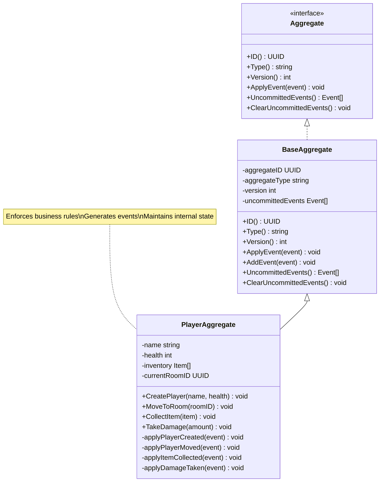

# Aggregate Structure and Responsibility Diagram

Here's the third diagram that illustrates what an aggregate is and how it functions in event sourcing:



## Aggregate Explanation

An aggregate is a cluster of domain objects treated as a single unit for consistency purposes. In event sourcing:

1. **Structure and Responsibility**:
    - Aggregates encapsulate related business logic and state
    - They enforce business rules and invariants (e.g., player can't have negative health)
    - Aggregates generate events when state changes occur
    - The Player aggregate manages player attributes, inventory, and location

2. **State Management**:
    - State is never directly modified; it's a result of applying events
    - The aggregate maintains internal state (e.g., name, health, inventory)
    - Events represent facts that happened in the past
    - Commands are evaluated against current state before generating events

3. **Event Application Process**:

    ```mermaid
    sequenceDiagram
        participant CMD as Command Handler
        participant AGG as Player Aggregate
        participant E as Events
    
        CMD->>AGG: MoveToRoom(newRoomID)
        
        activate AGG
        Note over AGG: Check if move is valid
        
        AGG->>AGG: Create PlayerMovedEvent
        AGG->>AGG: AddEvent(PlayerMovedEvent)
        
        Note over AGG: Event is added to<br>uncommitted events list
        
        AGG->>AGG: ApplyEvent(PlayerMovedEvent)
        
        Note over AGG: Internal state updated<br>(currentRoomID = newRoomID)
        
        AGG-->>CMD: Success
        deactivate AGG
        
        CMD->>E: Save uncommitted events
        
        Note over E: Events are persisted<br>to event store
    ```

4. **State Reconstitution**:
    - When loading an aggregate, it starts with an empty state
    - Historical events are loaded from the event store
    - Events are replayed in sequence to rebuild the current state
    - This ensures the state is always consistent with the event history

5. **Versioning**:
    - Each aggregate tracks its version (incremented with each event)
    - Used for optimistic concurrency control
    - Prevents conflicts when multiple processes try to modify the same aggregate

In your Adventure Quest game, aggregates like Player, Room, and Game provide natural boundaries for consistency.
For example, the Player aggregate ensures that game rules for player movement, inventory management,
and health are consistently enforced.