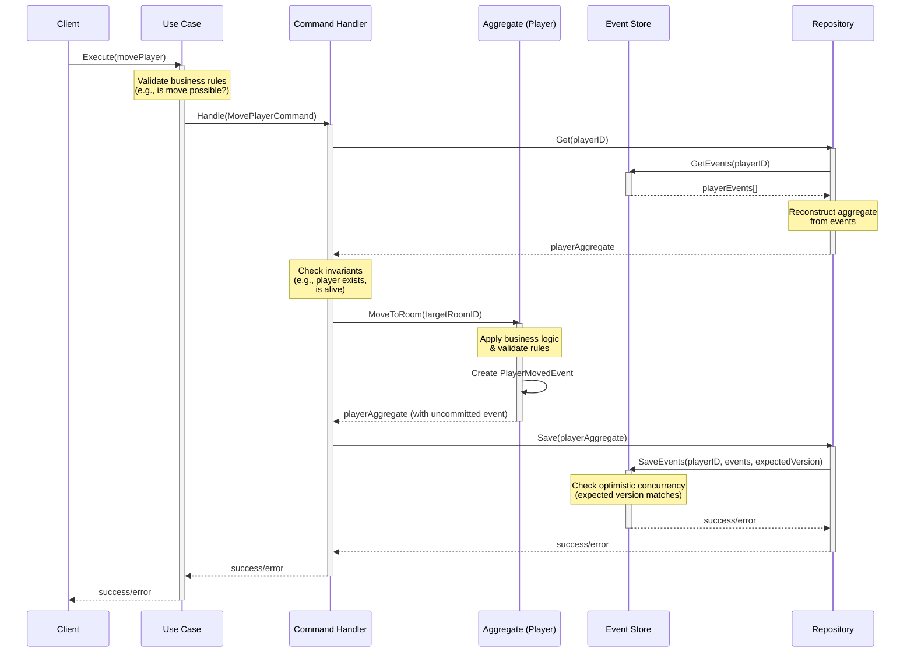

# Command Processing Flow Diagram

Here's the second diagram that details how commands are processed in the event sourcing architecture:

## Command Processing Explanation

This sequence diagram illustrates how commands flow through the system using a "MovePlayer" command example:

1. **Command Initiation**:
    - The client calls a use case to move a player to a new room
    - The use case performs initial validation (e.g., checking if the target room exists)

2. **Command Handling**:
    - The use case creates a MovePlayerCommand and passes it to the command handler
    - The command handler is responsible for coordinating the command execution

3. **Aggregate Reconstitution**:
    - The handler requests the player aggregate from the repository
    - The repository loads all events for the player from the event store
    - These events are replayed to rebuild the current state of the player

4. **Command Processing**:
    - The handler performs invariant checks (e.g., the player exists and is alive)
    - The aggregate applies domain logic to process the command
    - If valid, the aggregate generates a new PlayerMovedEvent

5. **Event Persistence**:
    - The updated aggregate with new uncommitted events is saved
    - The repository delegates to the event store to persist the new events
    - The event store checks for optimistic concurrency conflicts

6. **Result Handling**:
    - Success or error is propagated back to the client
    - Any concurrency conflicts result in errors that can be handled appropriately

This flow ensures:

- Commands are validated before state changes
- Business rules are enforced consistently
- State changes are tracked as immutable events
- Conflicts are detected through versioning

In the context of your Adventure Quest game, this approach ensures that players can only move to valid rooms and that
all movements are tracked historically, enabling features like replay or time-travel debugging of game sessions.