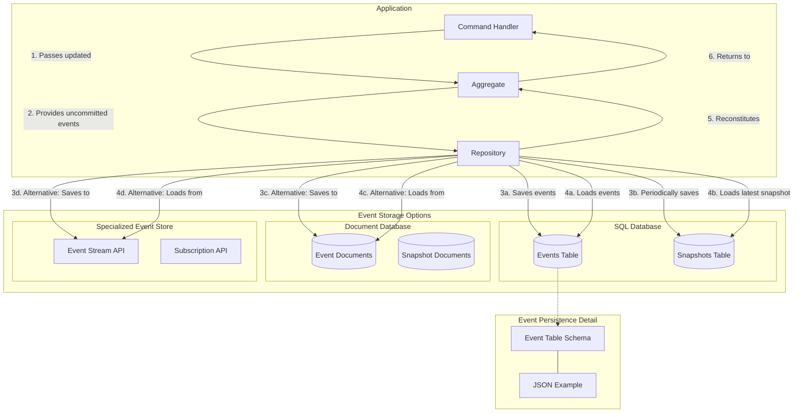

# Event Store and Persistence Diagram

Here's the sixth diagram that illustrates how events are stored and retrieved:



## Event Persistence Explanation

The event store is the backbone of an event sourcing system, providing reliable, append-only storage of all events:

1. **Storage Mechanism Options**:

    - **SQL Database**: Common choice for many systems
        - Simple schema with events table and optional snapshots
        - Good for systems already using relational databases
        - Supports transactions and robust querying capabilities

    - **Document Database**: Good for dynamic event schemas
        - Flexible JSON document structure for events
        - Efficient when storing large event payloads
        - Often provides good scaling characteristics

    - **Specialized Event Stores**: Purpose-built for event sourcing
        - EventStoreDB, Axon Server, etc.
        - Optimized for append-only event streams
        - Built-in support for subscriptions and projections

2. **Event Table Schema**:

    ```sql
    CREATE TABLE events (
        event_id UUID PRIMARY KEY,
        aggregate_id UUID NOT NULL,
        aggregate_type VARCHAR(255) NOT NULL,
        event_type VARCHAR(255) NOT NULL,
        event_version INT NOT NULL,
        event_data JSON NOT NULL,
        created_at TIMESTAMP NOT NULL,
        UNIQUE (aggregate_id, event_version)
    );
    
    CREATE INDEX idx_events_aggregate ON events(aggregate_id, event_version);
    CREATE INDEX idx_events_type ON events(event_type, created_at);
    ```

3. **Event JSON Example**:

    ```json
    {
      "event_id": "f8c3de3d-1fea-4d7c-a8b0-29f63c4c3454",
      "aggregate_id": "e52c3ff1-0f7a-4e36-9f65-dd3ca5a1a711",
      "aggregate_type": "player",
      "event_type": "player_moved",
      "event_version": 7,
      "created_at": "2023-04-12T15:23:47Z",
      "event_data": {
        "from_room_id": "a42f8bee-e2c9-4598-bf99-b4e1c394d6ab",
        "to_room_id": "f88c7e21-a235-4829-a698-7eab2b2bbc6d",
        "move_timestamp": "2023-04-12T15:23:45Z"
      }
    }
    ```

4. **Implementation Examples**:

    ```go
    // internal/infrastructure/eventstore/sql_event_store.go
    package eventstore
    
    type SQLEventStore struct {
        db *sql.DB
    }
    
    func (s *SQLEventStore) SaveEvents(aggregateID uuid.UUID, events []eventsourcing.Event, expectedVersion int) error {
        tx, err := s.db.Begin()
        if err != nil {
            return err
        }
        
        // Get current version to check concurrency
        var currentVersion int
        err = tx.QueryRow("SELECT COALESCE(MAX(event_version), 0) FROM events WHERE aggregate_id = ?", 
            aggregateID).Scan(&currentVersion)
        if err != nil {
            tx.Rollback()
            return err
        }
        
        // Optimistic concurrency check
        if expectedVersion > 0 && currentVersion != expectedVersion {
            tx.Rollback()
            return fmt.Errorf("concurrency conflict: expected version %d but got %d", 
                expectedVersion, currentVersion)
        }
        
        // Save all events in transaction
        stmt, err := tx.Prepare(`
            INSERT INTO events 
            (event_id, aggregate_id, aggregate_type, event_type, event_version, event_data, created_at)
            VALUES (?, ?, ?, ?, ?, ?, ?)
        `)
        if err != nil {
            tx.Rollback()
            return err
        }
        defer stmt.Close()
        
        for i, event := range events {
            version := currentVersion + i + 1
            eventData, err := json.Marshal(event.Payload())
            if err != nil {
                tx.Rollback()
                return err
            }
            
            _, err = stmt.Exec(
                uuid.New(),
                event.AggregateID(),
                event.AggregateType(),
                event.EventType(),
                version,
                eventData,
                time.Now(),
            )
            if err != nil {
                tx.Rollback()
                return err
            }
        }
        
        return tx.Commit()
    }
    
    func (s *SQLEventStore) GetEvents(aggregateID uuid.UUID) ([]eventsourcing.Event, error) {
        rows, err := s.db.Query(`
            SELECT event_id, aggregate_id, aggregate_type, event_type, event_version, event_data, created_at
            FROM events 
            WHERE aggregate_id = ? 
            ORDER BY event_version ASC`, 
            aggregateID)
        if err != nil {
            return nil, err
        }
        defer rows.Close()
        
        var events []eventsourcing.Event
        for rows.Next() {
            // Read event data and construct appropriate event object
            // Deserialize JSON to correct event type based on event_type
            // Add to events slice
        }
        
        return events, nil
    }
    ```

5. **Snapshot Optimization**:
    - Snapshots store aggregate state at a point in time
    - Reduces need to replay all events from the beginning
    - Typically created after a certain number of events
    - Snapshot example:

    ```json
    {
      "snapshot_id": "98f0a3b2-1dd2-4444-b537-8b0c35c30f12",
      "aggregate_id": "e52c3ff1-0f7a-4e36-9f65-dd3ca5a1a711",
      "aggregate_type": "player",
      "version": 100,
      "created_at": "2023-04-15T10:15:22Z",
      "state": {
        "name": "Aragorn",
        "health": 85,
        "level": 12,
        "current_room_id": "f88c7e21-a235-4829-a698-7eab2b2bbc6d",
        "inventory": ["sword", "shield", "potion"]
      }
    }
    ```

6. **Optimistic Concurrency Control**:
    - Event version serves as a concurrency check
    - Prevents conflicts when multiple processes update the same aggregate
    - Repository checks expected version when saving events
    - If version mismatch, operation fails and can be retried

In your Adventure Quest game, the event store provides:

- A complete history of all game actions
- The ability to rebuild any aggregate state at any point in time
- Support for debugging by examining the event sequence
- Protection against concurrent modifications to the same aggregate