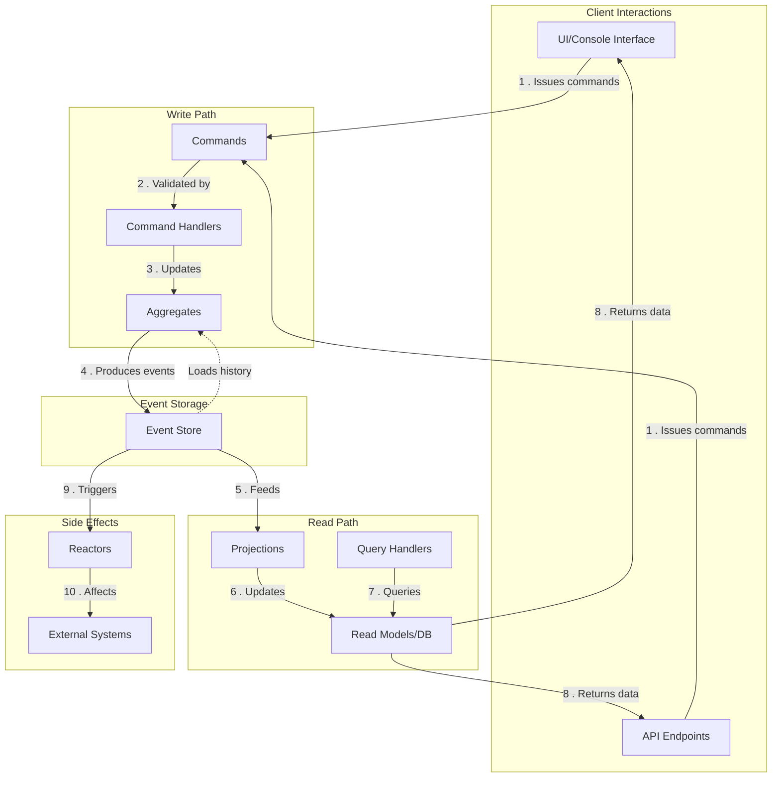

# High-Level Event Sourcing Architecture Diagram

Here's the first diagram that provides a high-level overview of the event sourcing architecture for your Adventure Quest
game:

## Architecture Overview Explanation

This diagram illustrates the core components of an event sourcing architecture:

1. **Client Interactions**: The entry points for user interactions (UI, API)

2. **Write Path**:
    - Commands represent user intentions (e.g., "MovePlayer")
    - Command Handlers validate commands and apply them to the appropriate aggregate
    - Aggregates enforce business rules and generate events when state changes

3. **Event Storage**:
    - The Event Store is the single source of truth, containing all events in sequence
    - Events are never modified once stored (immutable)

4. **Read Path**:
    - Projections subscribe to events and build optimized read models
    - Read Models are updated when relevant events occur
    - Query Handlers access these read models to fulfill client requests

5. **Side Effects**:
    - Reactors listen for events and perform side effects
    - Examples include notifications, achievements, or integration with external systems

6. **Aggregate Reconstitution**:
    - When handling commands, aggregates reload their state from events

This architecture provides several benefits:

- Complete audit history
- Separation of read and write concerns
- Ability to rebuild state from events
- Excellent support for eventual consistency

The next diagrams will dive deeper into each of these components with more specific examples from your Adventure Quest
game.