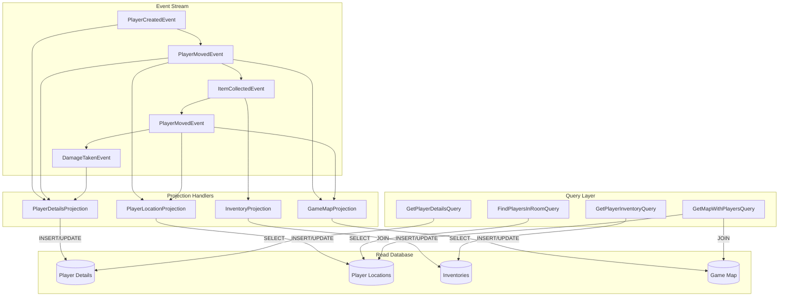

# Projection System Diagram

Here's the fourth diagram that demonstrates how projections work in an event sourcing system:



## Projection System Explanation

Projections are read models built from events that optimize data for specific query needs:

1. **Projection Purpose**:
    - Transform event data into query-optimized structures
    - Support efficient reads without reconstructing aggregates
    - Provide specialized views for different application needs
    - Enable complex queries that would be inefficient using event replay

2. **How Projections Work**:
    - Subscribe to the event stream
    - Process relevant events to update read models
    - Maintain denormalized data structures optimized for queries
    - Can be rebuilt from scratch by replaying all events

3. **Practical Database Example**:

    ```go
    // internal/infrastructure/projection/player_location_projection.go
    package projection
    
    type PlayerLocationProjection struct {
        db *sql.DB
    }
    
    func (p *PlayerLocationProjection) Apply(event eventsourcing.Event) error {
        switch evt := event.Payload().(type) {
        case *event.PlayerCreatedEvent:
            return p.insertNewPlayerLocation(event.AggregateID(), evt.InitialRoomID)
            
        case *event.PlayerMovedEvent:
            return p.updatePlayerLocation(event.AggregateID(), evt.ToRoomID)
        }
        return nil
    }
    
    func (p *PlayerLocationProjection) insertNewPlayerLocation(playerID, roomID uuid.UUID) error {
        _, err := p.db.Exec(
            "INSERT INTO player_locations (player_id, room_id, last_updated) VALUES (?, ?, NOW())",
            playerID, roomID,
        )
        return err
    }
    
    func (p *PlayerLocationProjection) updatePlayerLocation(playerID, roomID uuid.UUID) error {
        _, err := p.db.Exec(
            "UPDATE player_locations SET room_id = ?, last_updated = NOW() WHERE player_id = ?",
            roomID, playerID,
        )
        return err
    }
    ```

4. **Query Optimization Examples**:

For the "Find all players in a room" query:

- **Without Projection**: Would require loading all player aggregates and checking their current room
- **With Projection**: Simple SQL query on the player_locations table

    ```go
    // internal/app/query/find_players_in_room.go
    func (q *PlayerQueryHandler) FindPlayersInRoom(roomID uuid.UUID) ([]PlayerDTO, error) {
        rows, err := q.db.Query(
            "SELECT p.player_id, p.name, p.avatar FROM player_details p " +
            "JOIN player_locations l ON p.player_id = l.player_id " +
            "WHERE l.room_id = ?", 
            roomID,
        )
        // Process rows into DTOs...
    }
    ```

5. **Scalability Benefits**:
    - Read and write operations are decoupled
    - Specialized projections for different query patterns
    - Can scale read side independently of write side
    - Supports eventual consistency model

6. **Practical Game Examples**:
    - `PlayerDetailsProjection`: Player stats, health, name for profile views
    - `PlayerLocationProjection`: Which room each player is in
    - `InventoryProjection`: Items owned by each player
    - `GameMapProjection`: Room connections with current player positions
    - `LeaderboardProjection`: Points, achievements, rankings

In your Adventure Quest game, projections allow you to efficiently answer questions like:

- "Who is in this room?"
- "What items does this player have?"
- "Show me the game map with all player positions"

Without having to reconstitute aggregates from event history each time.