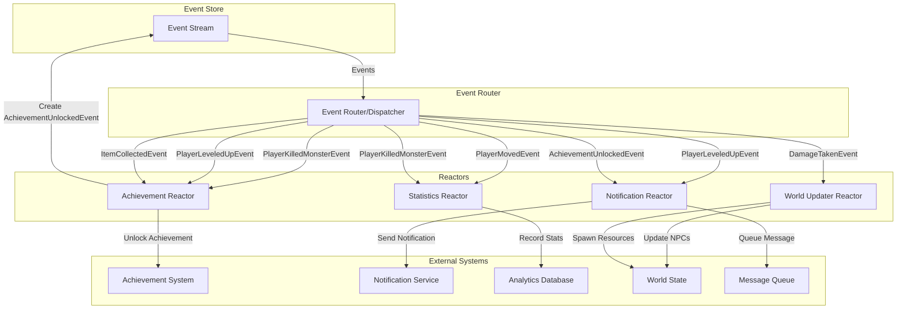

# Reactor System Diagram

Here's the fifth diagram that shows how reactors listen for events and perform side effects:



## Reactor System Explanation

Reactors are components that react to events by performing side effects without modifying the aggregate state directly:

1. **Reactor Purpose**:
    - Execute side effects in response to domain events
    - Decouple business logic from side-effect concerns
    - Handle cross-aggregate operations
    - Enable asynchronous processing of game mechanics

2. **How Reactors Work**:
    - Subscribe to specific events from the event stream
    - Execute business logic when relevant events occur
    - Perform operations on external systems
    - Can emit new events when appropriate

3. **Practical Implementation Example**:

    ```go
    // internal/infrastructure/reactor/achievement_reactor.go
    package reactor
    
    type AchievementReactor struct {
        achievementService service.AchievementService
        eventStore         eventsourcing.EventStore
    }
    
    func (r *AchievementReactor) Handle(event eventsourcing.Event) error {
        switch evt := event.Payload().(type) {
        case *event.PlayerKilledMonsterEvent:
            return r.processMonsterKill(event.AggregateID(), evt)
        case *event.ItemCollectedEvent:
            return r.processItemCollection(event.AggregateID(), evt)
        }
        return nil
    }
    
    func (r *AchievementReactor) processMonsterKill(playerID uuid.UUID, evt *event.PlayerKilledMonsterEvent) error {
        // Check monster kill count
        killCount, err := r.achievementService.GetMonsterKillCount(playerID, evt.MonsterType)
        if err != nil {
            return err
        }
        
        // Increment kill count
        killCount++
        if err := r.achievementService.UpdateMonsterKillCount(playerID, evt.MonsterType, killCount); err != nil {
            return err
        }
        
        // Check for achievements
        if killCount == 10 {
            // Create achievement unlocked event
            achievementEvent := event.NewAchievementUnlockedEvent(
                playerID,
                "MONSTER_HUNTER_BRONZE",
                fmt.Sprintf("Killed 10 %s monsters", evt.MonsterType),
            )
            
            // Store the new event
            return r.eventStore.SaveEvents(playerID, []eventsourcing.Event{achievementEvent}, 0)
        }
        
        return nil
    }
    ```

4. **Asynchronous Processing**:

    ```go
    // internal/infrastructure/router/event_router.go
    package router
    
    type EventRouter struct {
        reactors map[string][]reactor.Reactor
        queue    messaging.Queue
    }
    
    func (r *EventRouter) Route(event eventsourcing.Event) error {
        // Queue the event for asynchronous processing
        return r.queue.Publish("events", event)
    }
    
    func (r *EventRouter) RegisterReactor(eventType string, reactor reactor.Reactor) {
        r.reactors[eventType] = append(r.reactors[eventType], reactor)
    }
    
    func (r *EventRouter) StartProcessing() {
        r.queue.Subscribe("events", func(message interface{}) {
            event := message.(eventsourcing.Event)
            for _, reactor := range r.reactors[event.EventType()] {
                go func(r reactor.Reactor, e eventsourcing.Event) {
                    if err := r.Handle(e); err != nil {
                        // Log error, potentially retry
                    }
                }(reactor, event)
            }
        })
    }
    ```

5. **Game Mechanics Examples**:

    - **Achievement System**: Tracks player progress and unlocks achievements
        - "Monster Hunter" when killing 10 monsters of a type
        - "Explorer" when visiting 20 different rooms
        - "Collector" when gathering 50 unique items

    - **Notification System**: Alerts players of important events
        - Level-up congratulations
        - Achievement notifications
        - Nearby player or danger alerts

    - **World Updater**: Manages dynamic world changes
        - Respawning resources after a collection
        - NPC movement or state changes
        - Environmental effects based on player actions

    - **Statistics Tracker**: Records gameplay metrics
        - Tracking player activity for leaderboards
        - Recording game world statistics
        - Generating analytics data

6. **Scaling Benefits**:
    - Reactors can be scaled independently based on a load
    - Asynchronous processing prevents blocking the command flow
    - Failures in reactors don't affect the core game state
    - New game mechanics can be added without modifying core domain logic

In your Adventure Quest game, reactors enable rich gameplay features like achievements, notifications,
and dynamic world changes without complicating your core domain model.