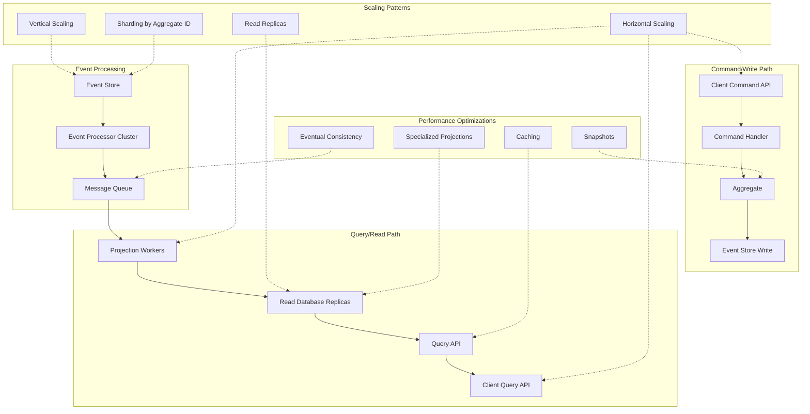

# Scaling and Performance Considerations Diagram

Here's the final diagram that illustrates how event sourcing scales and handles performance challenges:



## Scaling and Performance Explanation

Event sourcing architectures provide unique scaling capabilities but also introduce specific performance considerations:

1. **Separation of Read and Write Paths**:
    - Write path focuses on validation and appending events
    - Read path can be optimized independently for query performance
    - Different scaling strategies can be applied to each path

2. **Scaling Strategies**:

    - **Command/Write Path**:
        - Typically scales vertically (more powerful machines)
        - Transaction throughput is often the bottleneck
        - Can be horizontally scaled by sharding on aggregate ID

    - **Query/Read Path**:
        - Scales horizontally with multiple projection workers
        - Read database can use multiple replicas
        - Specialized projections for different query patterns

3. **Performance Optimization Techniques**:

    - **Snapshots**: Reduce event replay overhead
      ```go
      func (r *PlayerRepository) GetWithSnapshot(id uuid.UUID) (*player.Player, error) {
          // Try to load the latest snapshot
          snapshot, snapshotVersion, err := r.snapshotStore.GetLatestSnapshot(id)
          if err != nil && !errors.Is(err, ErrSnapshotNotFound) {
              return nil, err
          }
          
          // Load events after the snapshot version
          events, err := r.eventStore.GetEventsAfterVersion(id, snapshotVersion)
          if err != nil {
              return nil, err
          }
          
          // Create player from snapshot or new
          var p *player.Player
          if snapshot != nil {
              p = player.FromSnapshot(snapshot)
          } else {
              p = player.NewPlayer()
              // Need all events if no snapshot
              allEvents, err := r.eventStore.GetEvents(id)
              if err != nil {
                  return nil, err
              }
              events = allEvents
          }
          
          // Apply events
          for _, event := range events {
              p.ApplyEvent(event)
          }
          
          return p, nil
      }
      ```

    - **Caching**: Improve read performance
      ```go
      func (h *PlayerQueryHandler) GetPlayerDetails(id uuid.UUID) (*PlayerDetailsDTO, error) {
          // Try cache first
          cacheKey := fmt.Sprintf("player:%s", id)
          if cached, found := h.cache.Get(cacheKey); found {
              return cached.(*PlayerDetailsDTO), nil
          }
          
          // Query database if not in cache
          player, err := h.db.QueryRow("SELECT id, name, level, health FROM player_details WHERE id = ?", id)
          if err != nil {
              return nil, err
          }
          
          // Parse result
          dto := &PlayerDetailsDTO{}
          // ... map row to dto
          
          // Cache for future requests (with expiration)
          h.cache.Set(cacheKey, dto, time.Minute*5)
          
          return dto, nil
      }
      ```

    - **Specialized Projections**: Optimize for specific query patterns
        - Different projections for player stats, inventories, locations
        - Denormalized data structures for complex queries
        - Reduces join overhead and improves response times

    - **Asynchronous Processing**: Decouple command handling from event processing
      ```go
      // Event processor worker
      func (p *ProjectionProcessor) ProcessEvents() {
          for {
              // Pull batch of events from queue
              events := p.queue.PullEvents(100)
              
              // Process each event through relevant projections
              for _, event := range events {
                  for _, projection := range p.projections[event.EventType()] {
                      err := projection.Apply(event)
                      if err != nil {
                          // Log error and continue
                          p.logger.Error("projection error", err)
                      }
                  }
              }
              
              // Acknowledge processed batch
              p.queue.Acknowledge(events)
          }
      }
      ```

4. **Scalability Benefits**:

    - **Read Scalability**: Multiple projection workers and read database replicas
    - **Write Throughput**: Optimized for append-only operations
    - **Deployment Flexibility**: Different components can scale independently
    - **Resilience**: Event replay enables recovery from projection failures

5. **Performance Considerations**:

    - **Event Stream Size**: Growing event logs require management strategies
        - Archiving old events
        - Snapshot creation to reduce replay overhead
        - Version snapshots to handle schema evolution

    - **Eventual Consistency**: Read models may lag behind write operations
        - Projections update asynchronously after events are stored
        - Applications must be designed with this in mind
        - Polling or notifications for critical state updates

    - **Aggregate Size**: Large aggregates with many events can slow reconstitution
        - Design appropriate aggregate boundaries
        - Use snapshots for frequently accessed aggregates
        - Consider splitting large aggregates when appropriate

6. **Monitoring Considerations**:

   ```go
   // Monitor event processing lag
   func (m *MonitoringService) ReportProjectionLag() {
       // Count unprocessed events
       unprocessed, err := m.db.QueryRow("SELECT COUNT(*) FROM events WHERE created_at > ?", 
           time.Now().Add(-time.Hour)).Scan()
       
       // Report to monitoring system
       m.metrics.Gauge("event_processing.unprocessed_count", unprocessed)
       
       // Check projection tables for freshness
       lastProjected, err := m.db.QueryRow("SELECT MAX(last_updated) FROM player_details").Scan()
       if err == nil {
           lag := time.Since(lastProjected.(time.Time))
           m.metrics.Gauge("projection.player_details.lag_seconds", lag.Seconds())
       }
   }
   ```

In your Adventure Quest game, these scaling strategies will help handle:
- Concurrent players issuing commands
- Complex queries like "show me all players in a room with their inventory"
- Historical data access for features like replays or time travel debugging
- High-scale event processing for game mechanics like achievements or world updates

By implementing these patterns, your game can scale to handle more players while maintaining performance and reliability.