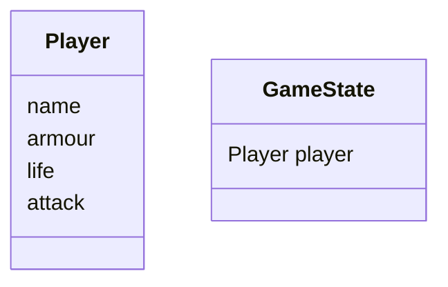

# Game State

- Player
- Non-playable characters
- Enemies

```mermaid
classDiagram
  class Player {
    name
    armour
    life
    attack
  }

  class GameState {
    Player player
  }
```

Game state is a singleton.
