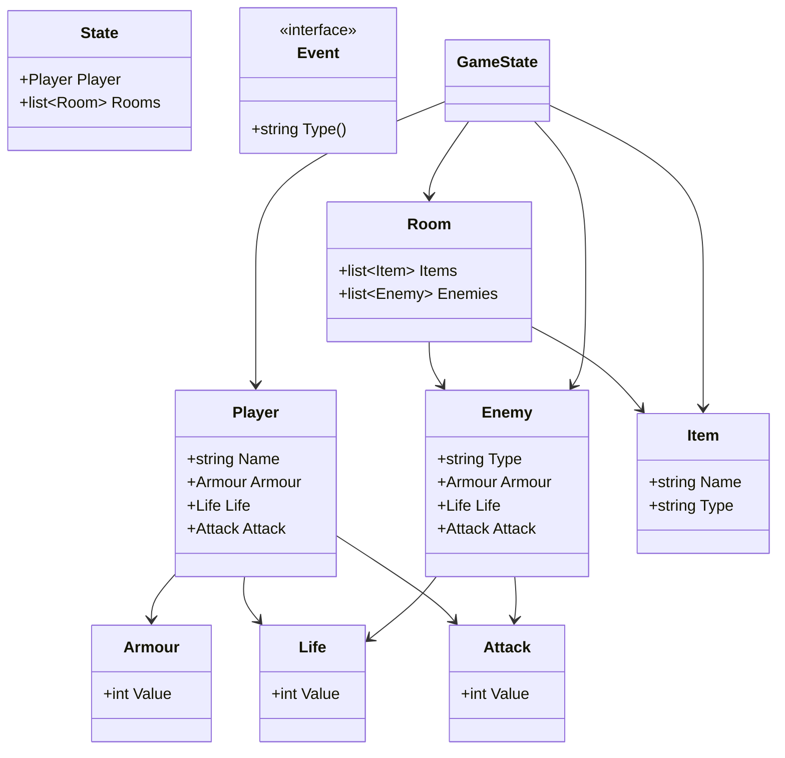

# go-design-patterns

## License

This project is licensed under the MIT License. See the LICENSE file for details.

### Game Idea: "Adventure Quest"

#### Overview

- The player navigates through different rooms in a dungeon.
- Each room can have different items, enemies, or puzzles.
- The player can collect items, fight enemies, and solve puzzles to progress.

#### Design Patterns to Use

1. **Singleton**: Manage the game state (e.g., player's health, inventory).
2. **Factory Method**: Create different types of rooms (e.g., treasure room, enemy room).
3. **Observer**: Notify the player when certain events occur (e.g., enemy appears, item found).
4. **Adapter**: Integrate different types of input methods (e.g., keyboard, voice commands).

#### Structure

```filetree
## Suggested Package Structure

go-design-patterns
└── domain
    ├── core
    │   ├── player
    │   │   └── player.go
    │   ├── enemy
    │   │   └── enemy.go
    │   ├── item
    │   │   └── item.go
    │   └── room
    │       └── room.go
    ├── aggregate
    │   └── game
    │       └── state.go
    └── event
        └── event.go
        └── store.go
```

#### UML Diagram



#### Example Code Snippets

**Singleton for Game State:**

```go
package creational

type GameState struct {
 Health   int
 Inventory []string
}

var instance *GameState

func GetGameState() *GameState {
 if instance == nil {
  instance = &GameState{Health: 100, Inventory: []string{}}
 }
 return instance
}
```

**Factory Method for Rooms:**

```go
package game

type Room interface {
 Enter() string
}

type TreasureRoom struct{}

func (r *TreasureRoom) Enter() string {
 return "You found a treasure!"
}

type EnemyRoom struct{}

func (r *EnemyRoom) Enter() string {
 return "An enemy appears!"
}

func RoomFactory(roomType string) Room {
 switch roomType {
 case "treasure":
  return &TreasureRoom{}
 case "enemy":
  return &EnemyRoom{}
 default:
  return nil
 }
}
```

**Observer for Events:**

```go
package behavioral

type Observer interface {
 Update(event string)
}

type Subject struct {
 observers []Observer
}

func (s *Subject) Attach(observer Observer) {
 s.observers = append(s.observers, observer)
}

func (s *Subject) Notify(event string) {
 for _, observer := range s.observers {
  observer.Update(event)
 }
}
```

**Adapter for Input Methods:**

```go
package structural

type InputMethod interface {
 GetInput() string
}

type Keyboard struct{}

func (k *Keyboard) GetInput() string {
 return "Keyboard input"
}

type VoiceCommand struct{}

func (v *VoiceCommand) GetInput() string {
 return "Voice command input"
}

type InputAdapter struct {
 method InputMethod
}

func NewInputAdapter(method InputMethod) *InputAdapter {
 return &InputAdapter{method: method}
}

func (a *InputAdapter) GetInput() string {
 return a.method.GetInput()
}
```

This structure and these patterns will help you build a robust and extensible text-based adventure game.
